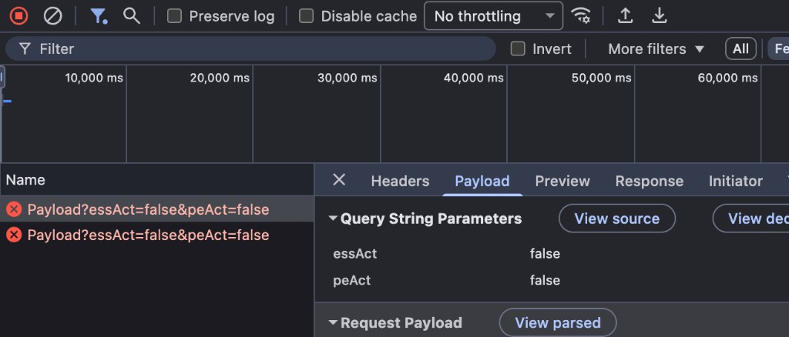

# XJTLU TimetablePlus 抢课

先在网页里选好课、抓到请求体，再交给脚本准点重放。凭据只放本地 `.env`，不要提交。

## 用法

1. 用浏览器登录 [TimetablePlus](https://timetableplus.xjtlu.edu.cn/)，进入选课页：  
   https://timetableplus.xjtlu.edu.cn/#/selection
2. 打开开发者工具 Console，把 `console.js` 全文粘进去回车。文件顶部只需改一处开抢时间 `targetTimeStr`（和 `.env` 的 `TT_TARGET_TIME` 一致即可）。脚本会把网页时间锁到开抢后 1 秒，方便点 SUBMIT；真实时间到点后自动恢复。
3. 在页面上勾好要抢的课，点确认 / SUBMIT。没到点后端会校验时间并失败，这是正常的，目的只是打出请求。
4. 打开 Network，点红色的 `Payload?essAct=false&peAct=false`，在 **Payload** 里复制 **Request Payload**（请求体）。没到点失败是正常的。长这样：

   

```json
{"moduleIds":["..."],"activityIds":["..."],"timestamp":1788220801000,"token":"..."}
```

5. 复制 `.env.example` 为 `.env`，填 UIM 账号，并把上一步整段 JSON 贴到 `TT_PAYLOAD=` 后面。`timestamp` / `token` 不用改，脚本开抢时会按真实时间重签。`XJTLU_OTP_URL` 填 `otpauth://totp/...` 设置链接，不是登录时那 6 位数字；账号必须先在 UIM 开过 OTP。新绑定直接扫二维码就能拿到链接；已经绑过则到密码管理器里导出该条目的设置 URL。
6. `TT_TARGET_TIME` 写成正式开抢时间，格式 `YYYY-MM-DD HH:MM:SS`。
7. 启动（二选一即可）。直接跑 Python 也会按 `TT_TARGET_TIME` 定时：先等到开抢前 5 分钟登录，再等到准点后 100ms 发请求。电脑别休眠、终端别关。

```bash
pip install -r requirements.txt
python ttEnroll.py
```

或：

```bash
docker compose up --build
```
